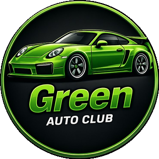

# Painel — Legendas | Green Auto Club

Painel web para buscar, filtrar e copiar legendas de carros. Ideal para uso em posts, stories e conteúdo do **Green Auto Club**.



## Funcionalidades

- **Busca** por modelo, motor, potência, país etc.
- **Filtros** por Marca e Tipo
- **Copiar legenda** completa ou só o título (um clique)
- **Adicionar legendas** novas (salvas no `localStorage` do navegador)
- **Exportar / Importar** JSON para levar as legendas customizadas para outro dispositivo
- Layout responsivo (desktop, tablet e mobile)
- Tema escuro com identidade visual do clube

## Como usar

1. Abra o arquivo `Legendas.html` no navegador (ou hospede os arquivos em qualquer servidor estático).
2. Use o campo de busca e os filtros de **Marca** / **Tipo** para encontrar o carro.
3. Clique em **Copiar legenda** para colar no Instagram, TikTok, YouTube etc.
4. Para incluir um carro novo:
   - Clique em **+ Adicionar**
   - Preencha título, marca, tipo e a legenda completa
   - Salve — a legenda fica disponível na sessão e no navegador

### Exportar / Importar

- **Exportar JSON**: gera o arquivo das legendas que você adicionou manualmente.
- **Importar JSON**: cole o JSON exportado e clique em Importar para restaurar em outro computador/navegador.

> As legendas base (já inclusas no código) não são alteradas. Só as customizadas ficam no `localStorage`.

## Estrutura dos arquivos

```
.
├── Legendas.html    # Página principal
├── Legendas.css     # Estilos
├── Legendas.js      # Lógica + base de legendas
├── img/
│   └── logo.png     # Logo do Green Auto Club
└── README.md
```

## Requisitos

Nenhum. Funciona direto no navegador, sem build e sem dependências.

Recomendado: navegador moderno (Chrome, Firefox, Edge, Safari) com suporte a `localStorage` e Clipboard API.

## Legendas incluídas (base)

Exemplos já cadastrados:

| Marca        | Modelos                          |
|--------------|----------------------------------|
| Porsche      | 911 GT3, GT3 RS, Carrera, Turbo  |
| BMW          | M3 (E46, E92, F80, G80), M4 F82  |
| Toyota       | Supra MK5                        |
| Audi         | R8 V10                           |
| McLaren      | P1                               |
| Lamborghini  | Huracán LP610                    |
| Nissan       | Skyline ER34                     |
| Chevrolet    | Astra                            |

Você pode expandir a lista pelo botão **+ Adicionar** ou editando o array `BASE_ITEMS` em `Legendas.js`.

## Personalização rápida

- **Cores**: variáveis CSS em `:root` no `Legendas.css` (`--brand`, `--bg`, `--panel` etc.).
- **Novas legendas fixas**: adicione objetos no array `BASE_ITEMS` dentro de `Legendas.js`.
- **Logo**: substitua `img/logo.png`.

## Licença

Uso interno / comunitário do Green Auto Club. Ajuste conforme a necessidade do projeto.

[](https://app.netlify.com/projects/greenautoclub/deploys)